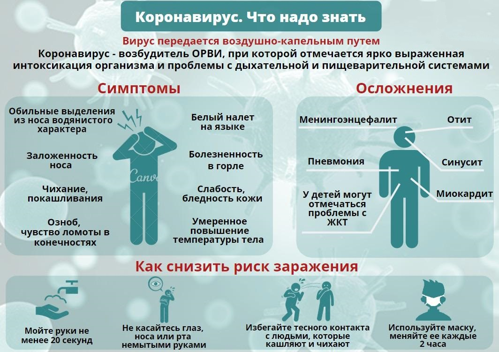

<!DOCTYPE html>
<html lang="en">
  <head>
    <meta name="yandex-verification" content="f7d61728f5271b62" />
    <meta charset="utf-8">
    

</head>

<body background="32.png"  data-lang="RU" data-country="RU">

<!--allrecords-->

<!-- T017 -->    
      

Апокалипсис 2020

      
Удаленка в ВУЗ'е
       

<form name="menu">
<select name="sel" onChange="linklist(document.menu.sel)">
<option value="#">Выберите страницу для перехода</option>
<option value="https://minzdrav.gov.ru/" target="new">Минздрав</option>
<option value="https://стопкоронавирус.рф/">Коронавирус в России</option>
<option value="https://coronavirus-monitor.ru/">Карта расспространения вируса</option>
</select>
</form>

<!-- T194 -->
            
        

<h1>Какие симптомы у коронавируса?</h1>
К наиболее распространенным симптомам COVID-19 относятся:— повышение температуры тела;— сухой кашель;— утомляемость.К более редким симптомам относятся боли в суставах и мышцах, заложенность носа, головная боль, конъюнктивит, боль в горле, диарея, потеря вкусовых ощущений или обоняния, сыпь и изменение цвета кожи на пальцах рук и ног.Немедленно обратитесь к врачу, если у вас повысилась температура, появились одышка, кашель, боль в грудной клетке, нарушения речи или движения.
     

 
 
 
        

<h1>Что такое коронавирус?</h1>
Коронавирус – это целое семейство вирусов, которое включает более 30 видов. Виды объединены в 2 подсемейства. Они могут заражать не только человека, но и животных – кошек, собак, птиц, свиней и крупный рогатый скот. Вирус был открыт в 1960 году и получил свое название из-за ворсинок на своей оболочке, стремящихся в различные стороны и напоминающих корону. Известно, что коронавирусы могут вызывать целый ряд заболеваний – от обычной простуды до тяжелого острого респираторного синдрома (ТОРС или «атипичной пневмонии»).

   
         
         
         
         
         
         
         

    <h1>Как правильно использовать маску?</h1>
Коронавирус – это целое семейство вирусов, которое включает более 30 видов. Виды объединены в 2 подсемейства. Они могут заражать не только человека, но и животных – кошек, собак, птиц, свиней и крупный рогатый скот. Вирус был открыт в 1960 году и получил свое название из-за ворсинок на своей оболочке, стремящихся в различные стороны и напоминающих корону. Известно, что коронавирусы могут вызывать целый ряд заболеваний – от обычной простуды до тяжелого острого респираторного синдрома (ТОРС или «атипичной пневмонии»).

     
        
    

<iframe width="560" height="315" src="https://www.youtube.com/embed/7D5bPLxU8U8?list=PL8w5HIWLMRa3s3bBMVDvBozFif7HsRj05" frameborder="0" allowfullscreen></iframe>
<!--/allrecords-->
</body>
</html>
